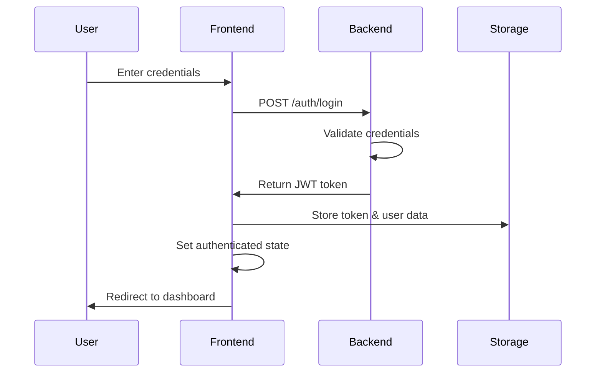

# 📚 ClimateBuddy Technical Documentation

## 🏗️ System Architecture

### High-Level Architecture
```
┌─────────────────┐    ┌─────────────────┐    ┌─────────────────┐
│   Frontend      │    │   Backend API   │    │  External APIs  │
│   (React SPA)   │◄──►│   (FastAPI)     │◄──►│ (OpenWeatherMap)│
└─────────────────┘    └─────────────────┘    └─────────────────┘
         │                       │
         ▼                       ▼
┌─────────────────┐    ┌─────────────────┐
│   LocalStorage  │    │   File System   │
│   (User Data)   │    │   (Logs/Cache)  │
└─────────────────┘    └─────────────────┘
```

### Component Architecture
```
App.tsx
├── AuthWrapper (Conditional)
│   ├── Login.tsx
│   └── Signup.tsx
└── Main App (Authenticated)
    ├── Navigation.tsx
    └── Content Router
        ├── ChatInterface.tsx
        ├── Dashboard.tsx
        ├── ActionTracker.tsx
        └── Community.tsx
```

## 🔐 Authentication System

### Authentication Flow


### JWT Token Structure
```json
{
  "header": {
    "alg": "HS256",
    "typ": "JWT"
  },
  "payload": {
    "sub": "user_id",
    "email": "user@example.com",
    "name": "User Name",
    "subscription": "free",
    "iat": 1640995200,
    "exp": 1641081600
  }
}
```

### Protected Routes
```typescript
// Route protection logic
if (!isAuthenticated) {
  return <AuthWrapper onAuthSuccess={handleAuthSuccess} />;
}
```

## 📊 Data Flow Architecture

### State Management
```typescript
// Global State Structure
interface AppState {
  // Authentication
  isAuthenticated: boolean;
  authUser: AuthUser | null;
  
  // User Profile
  userProfile: UserProfile;
  
  // Application Data
  currentView: ViewType;
  chatHistory: ChatMessage[];
  dashboardData: DashboardData | null;
  actions: ActionItem[];
}
```

### Data Persistence
```typescript
// LocalStorage Keys
const STORAGE_KEYS = {
  USER: 'climatebuddy-user',
  TOKEN: 'climatebuddy-auth-token',
  PROFILE: 'climatebuddy-profile',
  CHAT: 'climatebuddy-chat',
  ACTIONS: 'climatebuddy-actions'
};
```

## 🌐 API Architecture

### RESTful Endpoints

#### Authentication
```typescript
// Login
POST /api/auth/login
Body: { email: string, password: string, rememberMe?: boolean }
Response: { token: string, user: AuthUser }

// Signup
POST /api/auth/signup
Body: { name: string, email: string, password: string, ... }
Response: { token: string, user: AuthUser }

// Logout
POST /api/auth/logout
Headers: { Authorization: "Bearer <token>" }
Response: { message: "Logged out successfully" }
```

#### Dashboard
```typescript
// Get dashboard data
GET /api/dashboard/data?city={city}&days={days}&data_type={type}
Response: {
  city: string;
  current_weather: WeatherData;
  summary_stats: Record<string, string>;
  chart_data: {
    temperature: TemperatureData;
    air_quality: AirQualityData;
    weather_distribution: DistributionData;
  };
  air_quality: AirQualityData;
  forecast: ForecastData[];
}

// Search cities
GET /api/dashboard/cities/search?query={query}&limit={limit}
Response: { cities: CityData[] }
```

#### Chat
```typescript
// Send message
POST /api/chat/message
Body: { message: string, userProfile: UserProfile }
Response: { response: string, suggestedTopics?: string[] }

// Get subjects
GET /api/chat/subjects
Response: { subjects: string[] }
```

### Error Handling
```typescript
// Standard error response
interface APIError {
  detail: string;
  code?: string;
  timestamp: string;
}

// HTTP Status Codes
200: Success
400: Bad Request
401: Unauthorized
403: Forbidden
404: Not Found
500: Internal Server Error
```

## 🎨 UI/UX Design System

### Design Tokens
```css
/* Colors */
:root {
  --primary-gradient: linear-gradient(135deg, #667eea 0%, #764ba2 100%);
  --success-color: #4CAF50;
  --warning-color: #FF9800;
  --error-color: #F44336;
  --text-primary: #2d3748;
  --text-secondary: #718096;
  --background: #f7fafc;
  --surface: #ffffff;
}

/* Typography */
:root {
  --font-family: 'Inter', -apple-system, BlinkMacSystemFont, sans-serif;
  --font-size-xs: 0.75rem;
  --font-size-sm: 0.875rem;
  --font-size-base: 1rem;
  --font-size-lg: 1.125rem;
  --font-size-xl: 1.25rem;
  --font-size-2xl: 1.5rem;
  --font-weight-normal: 400;
  --font-weight-medium: 500;
  --font-weight-semibold: 600;
  --font-weight-bold: 700;
}

/* Spacing */
:root {
  --space-1: 0.25rem;
  --space-2: 0.5rem;
  --space-3: 0.75rem;
  --space-4: 1rem;
  --space-6: 1.5rem;
  --space-8: 2rem;
  --space-12: 3rem;
  --space-16: 4rem;
}

/* Border Radius */
:root {
  --radius-sm: 0.25rem;
  --radius-md: 0.5rem;
  --radius-lg: 0.75rem;
  --radius-xl: 1rem;
  --radius-2xl: 1.5rem;
}
```

### Component Patterns

#### Button Component
```typescript
interface ButtonProps {
  variant: 'primary' | 'secondary' | 'outline';
  size: 'sm' | 'md' | 'lg';
  disabled?: boolean;
  loading?: boolean;
  children: React.ReactNode;
  onClick?: () => void;
}
```

#### Form Component
```typescript
interface FormFieldProps {
  label: string;
  type: 'text' | 'email' | 'password' | 'select';
  value: string;
  onChange: (value: string) => void;
  error?: string;
  required?: boolean;
  placeholder?: string;
}
```

## 📱 Responsive Design

### Breakpoints
```css
/* Mobile First Approach */
@media (min-width: 640px) { /* sm */ }
@media (min-width: 768px) { /* md */ }
@media (min-width: 1024px) { /* lg */ }
@media (min-width: 1280px) { /* xl */ }
```

### Grid System
```css
.container {
  max-width: 1200px;
  margin: 0 auto;
  padding: 0 1rem;
}

.grid {
  display: grid;
  gap: 1rem;
}

.grid-cols-1 { grid-template-columns: repeat(1, 1fr); }
.grid-cols-2 { grid-template-columns: repeat(2, 1fr); }
.grid-cols-3 { grid-template-columns: repeat(3, 1fr); }
.grid-cols-4 { grid-template-columns: repeat(4, 1fr); }
```

## 🔧 Development Workflow

### Code Quality
```json
// ESLint Configuration
{
  "extends": [
    "react-app",
    "react-app/jest",
    "@typescript-eslint/recommended"
  ],
  "rules": {
    "no-unused-vars": "error",
    "prefer-const": "error",
    "no-console": "warn"
  }
}
```

### Testing Strategy
```typescript
// Component Testing
describe('Login Component', () => {
  it('should render login form', () => {
    render(<Login onLogin={mockLogin} />);
    expect(screen.getByLabelText(/email/i)).toBeInTheDocument();
  });

  it('should validate email format', () => {
    render(<Login onLogin={mockLogin} />);
    fireEvent.change(screen.getByLabelText(/email/i), {
      target: { value: 'invalid-email' }
    });
    expect(screen.getByText(/valid email/i)).toBeInTheDocument();
  });
});
```

### Performance Monitoring
```typescript
// Performance metrics
const performanceMetrics = {
  pageLoadTime: performance.now(),
  apiResponseTime: responseTime,
  componentRenderTime: renderTime,
  memoryUsage: performance.memory?.usedJSHeapSize
};
```

## 🚀 Deployment Architecture

### Frontend Deployment (Vercel)
```yaml
# vercel.json
{
  "version": 2,
  "builds": [
    {
      "src": "package.json",
      "use": "@vercel/static-build",
      "config": {
        "distDir": "build"
      }
    }
  ],
  "routes": [
    {
      "src": "/static/(.*)",
      "dest": "/static/$1"
    },
    {
      "src": "/(.*)",
      "dest": "/index.html"
    }
  ]
}
```

### Backend Deployment (Railway)
```dockerfile
# Dockerfile
FROM python:3.9-slim

WORKDIR /app

COPY requirements.txt .
RUN pip install -r requirements.txt

COPY . .

EXPOSE 8000

CMD ["uvicorn", "main:app", "--host", "0.0.0.0", "--port", "8000"]
```

### Environment Configuration
```bash
# Production Environment Variables
NODE_ENV=production
REACT_APP_API_URL=https://api.climatebuddy.com
WEATHER_API_KEY=your_production_key
JWT_SECRET_KEY=your_production_secret
DATABASE_URL=your_production_database
```

## 📊 Monitoring & Analytics

### Application Monitoring
```typescript
// Error tracking
window.addEventListener('error', (event) => {
  analytics.track('Error', {
    message: event.message,
    filename: event.filename,
    lineno: event.lineno,
    colno: event.colno
  });
});

// Performance tracking
const observer = new PerformanceObserver((list) => {
  list.getEntries().forEach((entry) => {
    analytics.track('Performance', {
      name: entry.name,
      duration: entry.duration,
      startTime: entry.startTime
    });
  });
});
```

### User Analytics
```typescript
// Feature usage tracking
const trackFeatureUsage = (feature: string, action: string) => {
  analytics.track('Feature Usage', {
    feature,
    action,
    userId: authUser?.id,
    timestamp: new Date().toISOString()
  });
};
```

## 🔒 Security Considerations

### Data Protection
- **Input Sanitization**: All user inputs are validated and sanitized
- **XSS Prevention**: React's built-in XSS protection
- **CSRF Protection**: Token-based CSRF protection
- **Data Encryption**: Sensitive data encrypted in transit and at rest

### Authentication Security
- **JWT Expiration**: Short-lived access tokens
- **Refresh Tokens**: Secure token refresh mechanism
- **Password Hashing**: bcrypt for password storage
- **Rate Limiting**: API rate limiting to prevent abuse

## 📈 Scalability Considerations

### Frontend Optimization
- **Code Splitting**: Lazy loading of components
- **Bundle Optimization**: Tree shaking and minification
- **Caching Strategy**: Service worker for offline support
- **CDN Integration**: Static asset delivery optimization

### Backend Optimization
- **Database Indexing**: Optimized database queries
- **Caching Layer**: Redis for session and data caching
- **Load Balancing**: Horizontal scaling capability
- **API Rate Limiting**: Prevent API abuse

## 🧪 Testing Strategy

### Unit Testing
```typescript
// Component testing with React Testing Library
import { render, screen, fireEvent } from '@testing-library/react';
import { Login } from './Login';

test('renders login form', () => {
  render(<Login onLogin={jest.fn()} />);
  expect(screen.getByRole('button', { name: /sign in/i })).toBeInTheDocument();
});
```

### Integration Testing
```typescript
// API integration testing
describe('Dashboard API', () => {
  it('should fetch weather data', async () => {
    const response = await fetch('/api/dashboard/data?city=London');
    const data = await response.json();
    expect(data.city).toBe('London');
    expect(data.current_weather).toBeDefined();
  });
});
```

### End-to-End Testing
```typescript
// E2E testing with Cypress
describe('User Authentication Flow', () => {
  it('should allow user to login and access dashboard', () => {
    cy.visit('/');
    cy.get('[data-testid="email-input"]').type('test@example.com');
    cy.get('[data-testid="password-input"]').type('password123');
    cy.get('[data-testid="login-button"]').click();
    cy.url().should('include', '/dashboard');
  });
});
```

## 📚 Additional Resources

### Documentation Links
- [React Documentation](https://reactjs.org/docs)
- [FastAPI Documentation](https://fastapi.tiangolo.com/)
- [TypeScript Handbook](https://www.typescriptlang.org/docs/)
- [OpenWeatherMap API](https://openweathermap.org/api)

### Development Tools
- **VS Code Extensions**: ES7+ React/Redux/React-Native snippets
- **Browser DevTools**: React Developer Tools
- **API Testing**: Postman or Insomnia
- **Version Control**: Git with conventional commits

### Community Resources
- **Discord Server**: Real-time developer support
- **GitHub Discussions**: Feature requests and Q&A
- **Stack Overflow**: Tagged with `climatebuddy`
- **Blog**: Technical articles and updates

---

**Last Updated**: January 2024  
**Version**: 1.0.0  
**Maintainer**: ClimateBuddy Development Team
